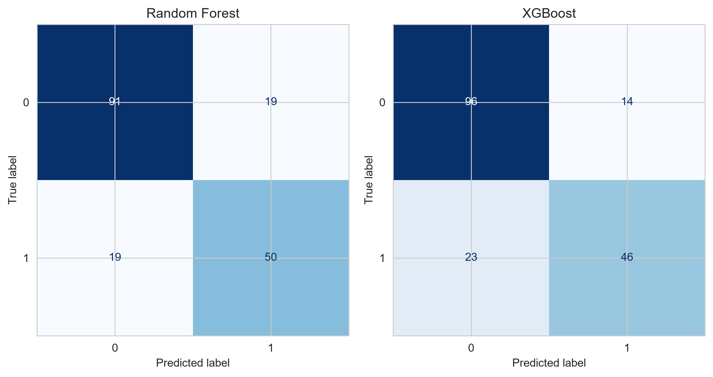
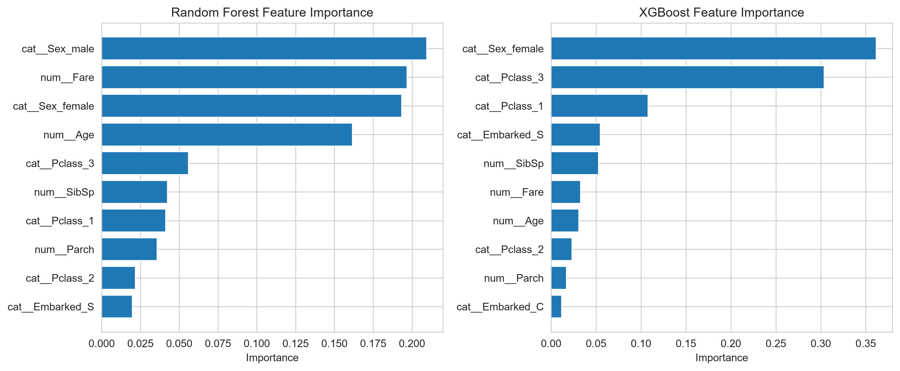
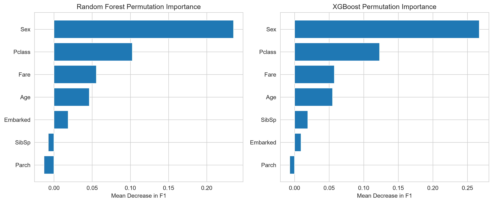
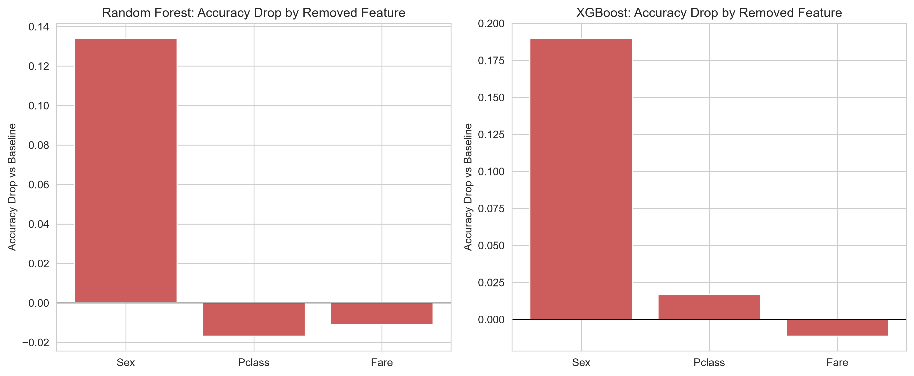

# Tabular Ensemble + Feature-Removal Ablation

## Problem statement

Two related classification tasks on tabular data. First, a from-scratch implementation of
a decision tree's split criterion (Gini impurity, entropy, information gain) validated
against `sklearn.tree.DecisionTreeClassifier` on Iris. Second, a Random Forest vs. XGBoost
comparison on Titanic survival prediction, with feature importance measured two ways
(built-in and permutation) and then *tested* rather than just plotted — an ablation study
that removes the top-3 important features one at a time, retrains, and measures the actual
accuracy/F1 cost of each.

## Dataset

**Titanic** (Kaggle "Titanic — Machine Learning from Disaster" schema, 891 rows) — used
for Steps 1, 2, and 4–8. 61.6% died / 38.4% survived (mild imbalance). Missing values in
`Age` (19.9%), `Cabin` (77.1%), and `Embarked` (0.2%) — `Cabin` is dropped outright given
how sparse it is, `Age` is median-imputed, `Embarked` mode-imputed.

**Iris** (`sklearn.datasets.load_iris`, 150 rows) — used only in Step 3 to validate the
manual split-criterion implementation against sklearn on data clean enough to sanity-check
by hand.

## Approach

1. **EDA** — missingness audit, target class balance, univariate/bivariate looks at
   `Sex`/`Pclass`/`Age`/`Fare` against survival.
2. **Preprocessing** — 80/20 stratified split (712/179 rows); numeric columns
   (`Age`, `Fare`, `SibSp`, `Parch`) median-imputed; categorical columns
   (`Sex`, `Embarked`, `Pclass`) mode-imputed and one-hot encoded via a `ColumnTransformer`.
   `PassengerId`, `Name`, `Ticket`, `Cabin` dropped. 7 raw columns → 12 model-ready features.
3. **Manual split criterion** (Iris) — Gini, entropy, information gain, a best-split
   search, and a recursive depth-limited tree, validated against sklearn.
4. **Random Forest** — tuned via `GridSearchCV`, `StratifiedKFold`, scored on F1,
   `class_weight="balanced"`.
5. **XGBoost** — same tuning/scoring standard.
6. **Feature importance, two ways** — built-in (fragmented across one-hot columns) vs.
   permutation (computed directly on raw columns by permuting the full pipeline's input).
7. **Ablation study** — top-3 features by permutation importance, removed one at a time,
   retrained, measured.
8. **Evaluation** — precision/recall/F1/ROC-AUC/confusion matrix for both tuned models.

## Final metrics (test set)

| Model | Accuracy | Precision | Recall | F1 | ROC-AUC |
|---|---|---|---|---|---|
| Random Forest | 0.7877 | 0.7246 | **0.7246** | **0.7246** | **0.8331** |
| XGBoost | **0.7933** | **0.7667** | 0.6667 | 0.7132 | 0.7923 |

No clean sweep either way: **XGBoost wins accuracy and precision; Random Forest wins
recall, F1, and ROC-AUC.** Which one is "better" depends on whether a false positive or a
false negative costs more in whatever this model is actually used for.

## Feature importance: built-in vs. permutation

Both models broadly agree between the two measures that `Sex`, `Fare`/`Pclass`, and `Age`
dominate — but the *relative weight* differs. XGBoost's built-in importance puts
`Sex_female` + `Pclass_3` alone at **66%** of total importance (0.362 + 0.304), while its
permutation importance spreads more evenly (`Sex` 0.267, `Pclass` 0.123 — `Pclass` gets
roughly a third the relative weight permutation gives it that built-in does). Random
Forest's two measures are more consistent with each other by comparison. Permutation
importance is the one used for Step 7's ablation, since it's measured on held-out data and
already sits at the right (raw-feature) granularity, rather than being split across
one-hot columns.

## Ablation results

Top-3 by permutation importance — identical for both models: `Sex`, `Pclass`, `Fare`.
Removed one at a time and retrained with each model's own tuned hyperparameters:

| Model | Removed | Accuracy | Accuracy Drop | F1 | F1 Drop | ROC-AUC |
|---|---|---|---|---|---|---|
| Random Forest | *(baseline)* | 0.7877 | — | 0.7246 | — | 0.8331 |
| Random Forest | Sex | 0.6536 | 0.1341 | 0.5694 | 0.1552 | 0.6931 |
| Random Forest | Pclass | 0.8045 | -0.0168 | 0.7482 | -0.0236 | 0.8344 |
| Random Forest | Fare | 0.7989 | -0.0112 | 0.7353 | -0.0107 | 0.8536 |
| XGBoost | *(baseline)* | 0.7933 | — | 0.7132 | — | 0.7923 |
| XGBoost | Sex | 0.6034 | 0.1899 | 0.4580 | 0.2552 | 0.6451 |
| XGBoost | Pclass | 0.7765 | 0.0168 | 0.6970 | 0.0162 | 0.7700 |
| XGBoost | Fare | 0.8045 | -0.0112 | 0.7244 | -0.0112 | 0.8342 |

- **`Sex` is overwhelmingly load-bearing for both models** — removing it costs 13.4pp of
  accuracy and 15.5pp of F1 for Random Forest, and an even larger 19.0pp/25.5pp for
  XGBoost. Neither model has anything else in the feature set that can cover for losing it.
- **`Pclass` costs XGBoost real performance when removed** (-1.7pp accuracy), but actually
  *improves* Random Forest's test accuracy, F1, and ROC-AUC when dropped — a case where a
  feature scores meaningfully on importance but isn't earning its place in the final model.
- **`Fare` improves both models' ROC-AUC when removed** (RF: 0.833→0.854, XGBoost:
  0.792→0.834), and improves XGBoost's accuracy and F1 too. `Fare` correlates with
  `Pclass`, and this looks like that redundancy actively costing XGBoost test performance
  rather than just being neutral — a finding a static importance plot alone wouldn't
  surface.

## Tuning notes

`StratifiedKFold(n_splits=5)`, scored on F1, `RandomForestClassifier(class_weight="balanced")`.

**Random Forest** — grid: `n_estimators` [100, 200], `max_depth` [None, 5, 10, 20],
`min_samples_split` [2, 5, 10], `max_features` [sqrt, log2].
Best: `{max_depth: 10, max_features: sqrt, min_samples_split: 10, n_estimators: 200}`
→ CV F1 **0.7687**.

**XGBoost** — grid: `n_estimators` [100, 200], `max_depth` [3, 5, 7],
`learning_rate` [0.01, 0.1, 0.2], `subsample` [0.8, 1.0].
Best: `{learning_rate: 0.2, max_depth: 3, n_estimators: 200, subsample: 1.0}`
→ CV F1 **0.7672**.

CV scores were nearly identical (0.7687 vs. 0.7672) — close enough that the test-set split
by metric (XGBoost ahead on accuracy/precision, Random Forest ahead on recall/F1/ROC-AUC)
is the more informative comparison than the CV ranking alone.

## What I'd do differently / add next

- **Feature engineering** — no `Title` or `FamilySize` extraction here; given how much
  weight both models put on `Sex`, a `Title` feature (which encodes sex plus marital/age
  cues) would be a natural next experiment, along with checking whether it dilutes or
  reinforces `Sex`'s importance the way it's known to in similar setups.
- **A third importance lens (SHAP)** — built-in and permutation already disagreed on how
  much weight `Pclass` deserves for XGBoost; SHAP would help settle that and give
  per-prediction explanations, not just global rankings.
- **Investigate why `Fare` and `Pclass` actively hurt Random Forest / XGBoost respectively**
  — beyond noting the correlation, a follow-up ablation removing `Fare` and `Pclass`
  *together* would show whether the redundancy itself is the issue, versus one feature
  being uninformative on its own.
- **Threshold tuning** instead of the default 0.5 cutoff, now that Step 8 shows the two
  models trade off precision vs. recall differently.
- **Fix the Step 5 hyperparameter display** — `list(grid_search.best_params_)` only prints
  the parameter *names*, not their values (`dict(...)` or printing the object directly
  would show both).
